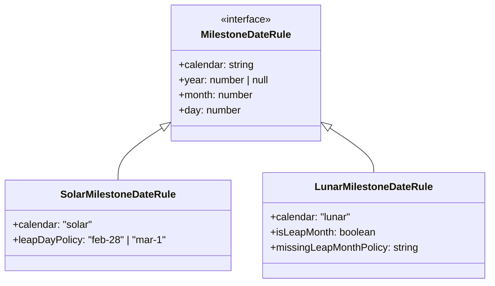
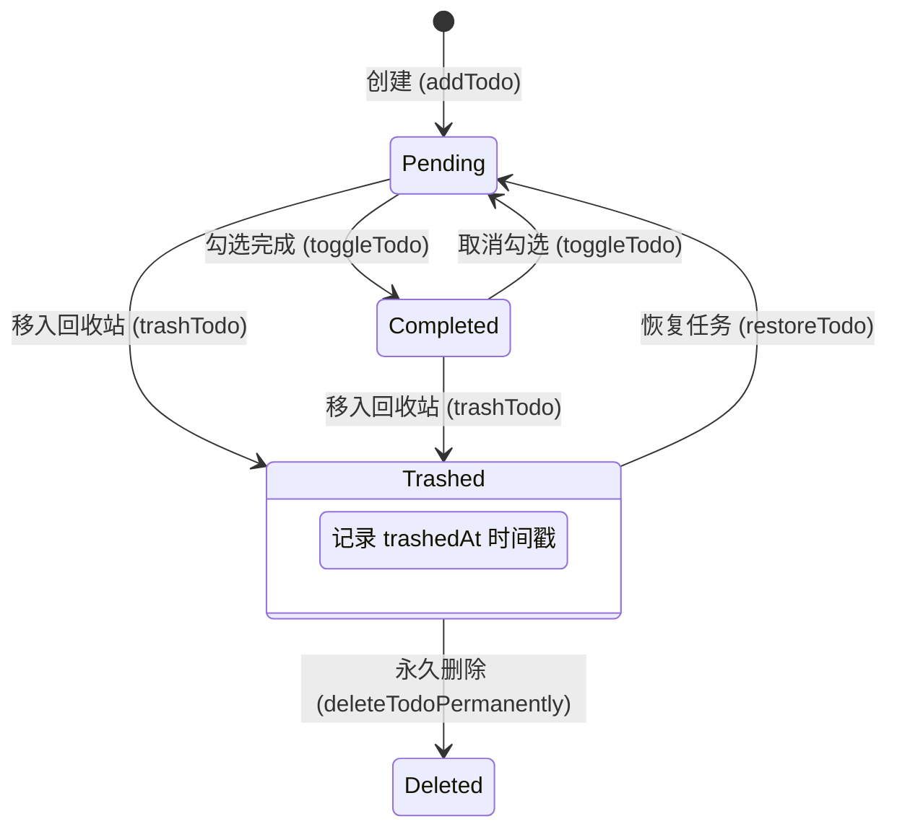
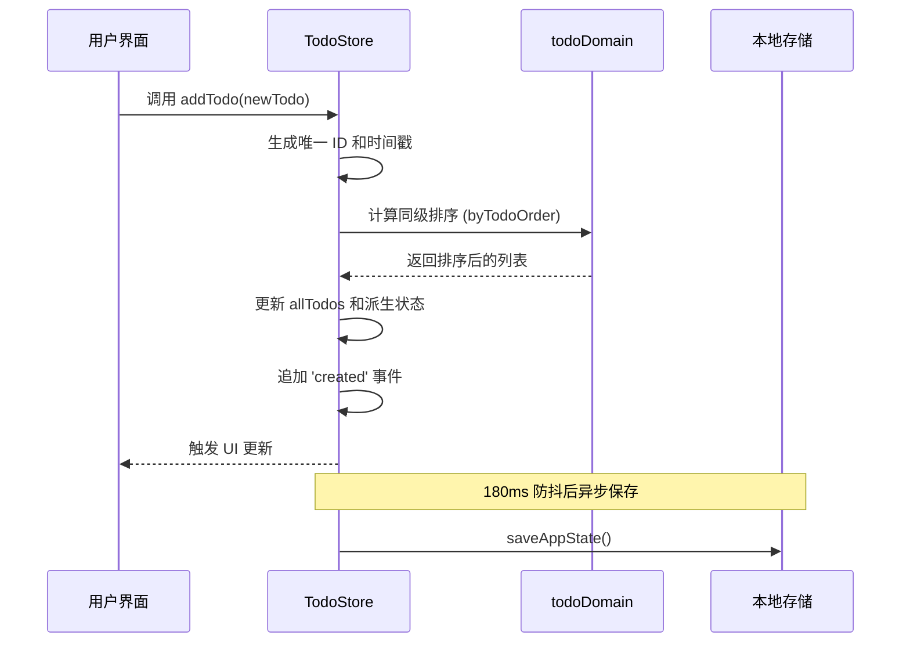
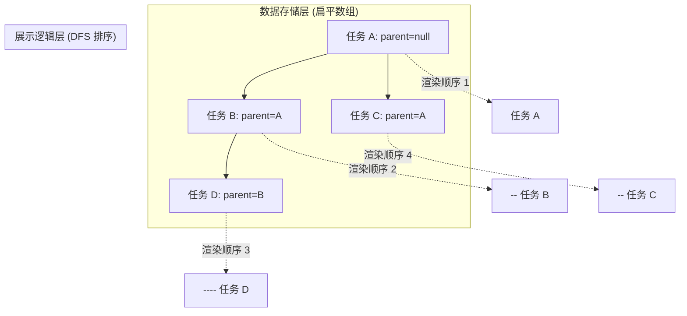
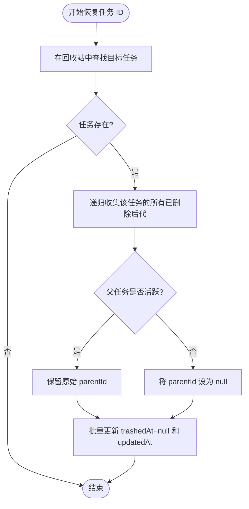
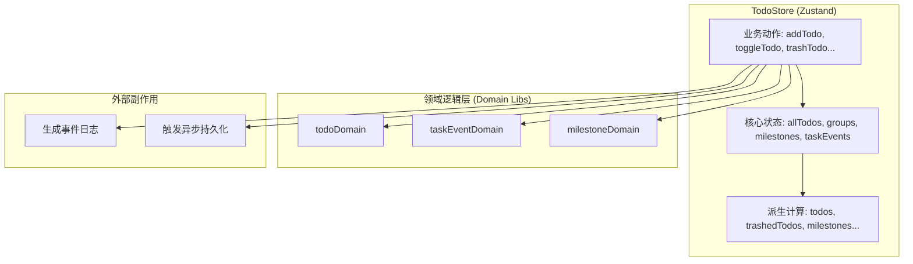

# 任务模型与状态流转

## 目录
1. [模块概览](#模块概览)
2. [引言](#引言)
3. [核心数据模型](#核心数据模型)
   - [Todo 实体定义](#todo-实体定义)
   - [任务事件 (TaskEvent)](#任务事件-taskevent)
   - [里程碑日期规则 (MilestoneDateRule)](#里程碑日期规则-milestonedaterule)
4. [核心组件与职责](#核心组件与职责)
   - [领域逻辑层 (todoDomain.ts)](#领域逻辑层-tododomaints)
   - [状态管理层 (todoStore.tsx)](#状态管理层-todostoretsx)
5. [任务生命周期与状态流转](#任务生命周期与状态流转)
   - [状态机模型](#状态机模型)
   - [状态转换逻辑](#状态转换逻辑)
   - [任务创建序列](#任务创建序列)
6. [领域逻辑深度解析](#领域逻辑深度解析)
   - [树形结构与子任务处理](#树形结构与子任务处理)
   - [回收站操作与分支恢复](#回收站操作与分支恢复)
   - [排序与位置计算](#排序与位置计算)
7. [状态管理集成实现](#状态管理集成实现)
   - [Zustand Store 结构](#zustand-store-结构)
   - [持久化与同步机制](#持久化与同步机制)
8. [测试策略与覆盖说明](#测试策略与覆盖说明)
9. [文件引用](#文件引用)

## 模块概览

本模块是 LightFlux 的核心业务逻辑层，负责管理任务（Todo）的完整生命周期、状态流转以及与之关联的领域逻辑。它不仅定义了任务的数据结构，还实现了复杂的树形任务管理、回收站恢复逻辑以及基于事件的任务追踪系统。

**模块统计信息：**
- **核心文件数**：约 6 个核心文件，定义了从基础类型到复杂状态管理的所有逻辑。
- **总文件数**：涉及 `lightflux/types/`、`lightflux/store/` 和 `lightflux/tests/` 目录下约 15 个相关文件。
- **子模块分布**：
  - `lightflux/types/`: 提供系统级的类型契约，如 `Todo`、`Milestone` 等。
  - `lightflux/store/`: 包含领域逻辑（Domain Logic）和状态存储（Store）。
  - `lightflux/tests/`: 针对核心逻辑的完备单元测试集。

本页面将深入探讨 `Todo` 实体的内部结构、任务在不同阶段的状态转换、领域逻辑的纯函数实现，以及这些逻辑如何集成到 Zustand 状态管理中以驱动 UI 更新。我们将涵盖从基础的 CRUD 操作到复杂的递归树恢复算法的方方面面。

## 引言

在 LightFlux 系统中，任务（Todo）不仅仅是一个简单的待办项，它是整个应用交互的核心。一个任务可以拥有复杂的富文本内容、分级的子任务结构、关联的里程碑以及详细的变更历史记录。为了应对这种复杂性，系统在设计上追求逻辑的解耦与数据的纯净。

为了保证业务逻辑的清晰与可测试性，LightFlux 采用了**领域驱动设计（DDD）**的简化思想，将逻辑分为三个层次：
1. **类型层 (Types)**：定义稳定的数据契约，确保系统各部分对“任务”的理解一致。这部分代码几乎不包含逻辑，仅作为结构定义。
2. **领域逻辑层 (Domain Logic)**：一组纯函数，负责处理复杂的业务规则（如树形结构的展开、回收站的递归恢复等）。这些函数不依赖于任何框架，输入确定的数据，输出确定的结果，极易进行单元测试。
3. **状态管理层 (Store)**：集成领域逻辑，管理内存中的状态，并负责与持久化存储（如 AsyncStorage）的交互。它作为 UI 和领域逻辑之间的桥梁，处理副作用和异步操作。

这种架构确保了即使 UI 框架发生变化（例如从 React Native 迁移到 Web），核心的任务管理逻辑依然保持稳健和独立，大大降低了系统的维护成本。

## 核心数据模型

核心数据模型定义了任务及其相关实体的属性。理解这些模型是掌握 LightFlux 业务逻辑的基础。

### Todo 实体定义

`Todo` 接口是系统的基石。它包含了任务的基本信息、状态标识、时间戳以及用于构建树形结构的关联字段。

```typescript
export interface Todo {
  id: string;               // 唯一标识符，通常由时间戳和随机字符串生成
  title: string;            // 任务标题
  completed: boolean;       // 完成状态标识
  completedAt: number | null; // 完成时间戳
  createdAt: number;        // 创建时间戳
  updatedAt: number;        // 最后更新时间戳
  scheduledDate: string;    // 计划日期（YYYY-MM-DD 格式）
  groupId: string | null;   // 所属分组 ID
  milestoneId: string | null; // 关联的里程碑 ID
  parentId: string | null;  // 父任务 ID，用于实现子任务结构
  priority: TodoPriority;   // 优先级：'none' | 'high' | 'medium' | 'low'
  sortOrder: number;        // 排序序号，用于同级任务的排序
  trashedAt: number | null; // 进入回收站的时间戳，为 null 表示活跃状态
  content: RichTextDocument; // 富文本内容，支持多层级节点
}
```

**关键字段解析：**
- **`parentId`**: 通过该字段，任务可以形成树状结构。LightFlux 支持无限层级的子任务，但在 UI 上通常展示为两层或三层。这种设计避免了嵌套过深导致的交互困难，同时在数据结构上保持了灵活性。
- **`trashedAt`**: 这是一个关键的状态标识。当该字段不为 `null` 时，任务被视为处于“回收站”状态。这种设计允许系统轻松实现“软删除”和“一键恢复”，因为数据并未真正从数组中移除。
- **`content`**: 采用 `RichTextDocument` 结构，这是一种类似 Prosemirror 的 JSON 格式，支持加粗、链接、列表等富文本特性。它允许用户在任务描述中记录丰富的信息，而不仅仅是纯文本。

### 任务事件 (TaskEvent)

为了追踪任务的生命周期，系统引入了 `TaskEvent`。每当任务发生重大变更（如创建、完成、重排期、移入回收站）时，都会生成一个事件记录。

```typescript
export type TaskEventType =
  | 'created'
  | 'completed'
  | 'reopened'
  | 'rescheduled'
  | 'trashed'
  | 'restored';

export interface TaskEvent {
  id: string;
  taskId: string;
  type: TaskEventType;
  occurredAt: number;
  metadata?: TaskEventMetadata;
}
```

这些事件记录了任务从“摇篮到坟墓”的每一个关键节点。它们不仅用于展示任务的“历史记录”视图，还为后续的数据分析（如任务完成效率分析、排期变更频率统计）提供了原始数据支持。

### 里程碑日期规则 (MilestoneDateRule)

虽然里程碑（Milestone）是独立的实体，但它与任务紧密相关。里程碑的日期规则设计非常精巧，支持公历和农历，并能处理闰月等复杂情况。

下面的类图展示了里程碑日期规则的继承与组合结构，这对于理解 LightFlux 如何处理复杂的历法计算至关重要。



**图示说明**：`MilestoneDateRule` 采用 TypeScript 的联合类型实现。公历规则（Solar）关注闰年 2 月 29 日在非闰年的处理策略（是回退到 28 日还是顺延到 3 月 1 日），而农历规则（Lunar）则需要处理复杂的闰月逻辑，以及当某年缺少特定闰月时的回退方案。这种设计确保了提醒系统在各种历法下都能准确运行。

**Section sources**:
- [lightflux/types/todo.ts](lightflux/types/todo.ts)
- [lightflux/store/taskEventDomain.ts](lightflux/store/taskEventDomain.ts)

## 核心组件与职责

LightFlux 的任务管理逻辑主要分布在两个核心文件中，体现了关注点分离的原则。

### 领域逻辑层 (todoDomain.ts)

该文件是系统的“大脑”，包含了一系列处理 `Todo` 数组的纯函数。这些函数严格遵循函数式编程原则，不产生副作用。

**主要职责：**
- **排序与组织**：实现 `orderWithSubtasks` 函数，将扁平的任务数组转换为符合树形逻辑的展示序列。这是 UI 渲染树形列表的关键。
- **层级计算**：计算任务的子任务数量、同级索引等，为 UI 提供辅助元数据。
- **复杂变更处理**：处理回收站的批量操作，如 `restoreTodoBranch`（恢复任务及其整个子树）。它需要处理复杂的父子关系重组。

### 状态管理层 (todoStore.tsx)

这是基于 Zustand 构建的状态中心，负责驱动 React UI 并处理所有外部交互。

**主要职责：**
- **状态持有**：维护 `allTodos`（原始数据）、`todos`（过滤后的活跃任务）、`trashedTodos`（回收站任务）等多个派生列表。
- **动作触发**：提供 `addTodo`、`toggleTodo`、`trashTodo` 等方法。这些方法内部调用领域逻辑函数计算新状态，并触发视图重绘。
- **持久化同步**：监听状态变化，通过防抖（Debounce）机制将数据异步保存到本地存储，确保数据安全。
- **事件生成**：在执行更新动作时，自动对比新旧状态并生成相应的 `TaskEvent`，维持审计追踪。

**Section sources**:
- [lightflux/store/todoDomain.ts](lightflux/store/todoDomain.ts)
- [lightflux/store/todoStore.tsx](lightflux/store/todoStore.tsx)

## 任务生命周期与状态流转

任务的生命周期是一个从创建到最终删除的动态过程，涉及多个状态的切换。

### 状态机模型

任务在 LightFlux 中主要有四种宏观状态：**待办 (Pending)**、**已完成 (Completed)**、**回收站 (Trashed)** 和 **永久删除 (Deleted)**。

下面的状态机图详细描述了这些状态之间的转换触发条件和属性变化。



**状态流转说明**：
1. **创建**：新任务通过 `addTodo` 进入 `Pending` 状态，此时 `completed` 为 `false`，`trashedAt` 为 `null`。
2. **完成切换**：用户点击复选框触发 `toggleTodo`，任务在 `Pending` 和 `Completed` 之间自由切换。完成时会记录精确的 `completedAt` 时间戳。
3. **软删除**：任何活跃任务都可以被移入回收站。此时 `trashedAt` 被设为当前时间戳。注意，任务在回收站中依然保留其原始的 `completed` 状态，这有助于恢复后保持原样。
4. **恢复**：恢复操作会将 `trashedAt` 重置为 `null`。如果任务的父任务仍在回收站中，系统会自动将被恢复的任务提升为顶层任务，以防止它在 UI 中“消失”。
5. **永久删除**：从 `allTodos` 数组中彻底移除该项，此操作不可逆。

### 状态转换逻辑

在 `todoStore.tsx` 中，状态转换通常伴随着事件的产生。例如 `toggleTodo` 的实现，它不仅改变了 `completed` 标志，还记录了更新时间，并产生了一个新的 `TaskEvent`。这种模式确保了状态变更和审计日志的原子性。

### 任务创建序列

当用户创建一个新任务时，系统会经历一系列复杂的步骤，包括 ID 生成、位置计算和事件记录。下面的序列图展示了这一过程。



该流程展示了 LightFlux 如何处理高频的 UI 操作。通过在内存中立即更新并异步持久化，系统保证了极佳的交互响应速度，同时利用防抖机制减少了不必要的磁盘写入。

**Section sources**:
- [lightflux/store/todoStore.tsx:L158-L225](lightflux/store/todoStore.tsx#L158-L225)
- [lightflux/store/taskEventDomain.ts:L60-L110](lightflux/store/taskEventDomain.ts#L60-L110)

## 领域逻辑深度解析

领域逻辑层处理了许多非直观的业务规则，特别是涉及树形结构和批量操作时。

### 树形结构与子任务处理

LightFlux 的任务数据在存储上是扁平的（数组形式），但在展示时需要呈现为树形。`orderWithSubtasks` 函数负责这一转换。

下面的流程图展示了如何将扁平的任务数据映射为具有层级感的 UI 展示序列。



**逻辑解析**：
`orderWithSubtasks` 使用深度优先搜索（DFS）算法。它首先从 `allTodos` 中筛选出所有顶级任务（即 `parentId` 为 `null` 或父任务不存在于当前视图中的任务），按照 `sortOrder` 进行初始排序。然后，算法递归地遍历每个任务，查找其子任务并将其插入到父任务紧随其后的位置。为了防止由于意外的循环引用（例如 A 的父是 B，B 的父是 A）导致的系统崩溃，算法内部维护了一个 `visited` 集合，确保每个任务在一次排序中只出现一次。

### 回收站操作与分支恢复

当一个带有子任务的任务被移入回收站时，整个分支都会被标记为已删除。但恢复操作则更加灵活且具有保护性。

**分支恢复算法流程**：
下面的流程图详细描述了 `restoreTodoBranch` 函数的决策逻辑。



**核心逻辑说明**：
1. **收集家族**：使用 `collectTodoFamily` 辅助函数，通过循环迭代找到目标节点及其所有在回收站中的后代。这种非递归的实现方式避免了在超深树结构下的栈溢出风险。
2. **父节点检查**：这是最关键的一步。如果用户恢复了一个子任务，而其父任务仍在回收站中，该子任务如果保留原有的 `parentId`，在活跃任务列表中将因为找不到“根”而无法显示。因此，系统会自动将其“断开”并提升为顶级任务。
3. **批量更新**：为了性能考虑，所有的状态变更都在一次数组映射操作中完成。

### 排序与位置计算

任务的排序由 `sortOrder` 字段决定。在 `addTodo` 或 `reorderTask` 时，系统会计算新的排序值。

- **插入逻辑**：当用户选择在特定任务后插入新任务时，系统会获取该层级的所有兄弟节点，在数组的指定位置插入新项，然后重新分配所有兄弟节点的 `sortOrder`。这种“重写同级顺序”的策略虽然简单，但极大地简化了排序逻辑的复杂性。
- **重排逻辑**：`reorderTask` 接受一个 `targetIndex`。它首先计算出拖拽任务在兄弟序列中的新位置，然后批量更新受影响节点的 `sortOrder`。通过这种方式，LightFlux 保证了即使在多端同步后，任务的显示顺序依然能够保持一致。

**Section sources**:
- [lightflux/store/todoDomain.ts:L26-L62](lightflux/store/todoDomain.ts#L26-L62)
- [lightflux/store/todoDomain.ts:L106-L139](lightflux/store/todoDomain.ts#L106-L139)

## 状态管理集成实现

Zustand Store 不仅仅是一个数据容器，它还负责协调各个领域模块，确保状态的一致性。

### Zustand Store 结构

`useTodoStore` 整合了任务、分组、里程碑和事件四大模块的状态。它采用了一种“单一事实来源”的设计模式。



**派生状态的自动更新**：
Store 使用了 `todoState` 和 `milestoneState` 辅助函数。这些函数就像数据库的视图一样，每当底层数据发生变化时，它们会自动运行排序和过滤逻辑。这使得 UI 组件可以直接订阅 `todos` 或 `trashedTodos`，而无需关心背后的过滤细节。

### 持久化与同步机制

为了保证数据不丢失，Store 实现了自动持久化机制。由于移动端环境的特殊性（如应用可能随时被系统杀死），数据的及时保存至关重要。

1. **版本化存储**：数据结构中包含 `schemaVersion`。当应用升级且数据模型发生变化时，系统可以根据版本号执行相应的迁移脚本（参考 `todoStorageMigration.test.ts`）。
2. **异步非阻塞保存**：持久化操作通过 `saveAppState` 异步执行，不会阻塞 UI 线程的渲染。
3. **智能防抖**：`TodoProvider` 组件中维护了一个 `useEffect`。它监听核心状态的变化，但不会立即保存，而是等待 180ms 的静默期。如果在此期间状态再次变化，计时器会重置。这有效地合并了连续的输入操作（如用户快速输入标题）。
4. **健康检查**：如果保存失败，系统会记录错误时间戳并可能在 UI 上展示同步失败的警告，引导用户进行检查。

**Section sources**:
- [lightflux/store/todoStore.tsx:L105-L148](lightflux/store/todoStore.tsx#L105-L148)
- [lightflux/store/todoStore.tsx:L765-L790](lightflux/store/todoStore.tsx#L765-L790)

## 测试策略与覆盖说明

由于核心逻辑被抽离为纯函数，LightFlux 的测试非常高效且可靠。这保证了即使在进行大规模重构时，核心业务逻辑依然能够正常工作。

**测试重点：**
- **边界情况处理**：例如当任务数组为空时，或者当任务的 `parentId` 指向一个不存在的 ID 时，系统是否能优雅地处理而不会崩溃。
- **回归测试**：专门针对曾经出现的 Bug 编写测试用例。例如，确保在清空回收站删除父任务时，那些已经被恢复到活跃列表的子任务不会被错误地一起删除。
- **索引一致性**：验证 `buildSiblingIndexById` 在跨越不同分组和不同层级时，生成的索引是否唯一且连续。

**代码示例 (来自 `todoDomain.test.ts`)**：
```typescript
it('detaches active descendants when emptying old trash data', () => {
  const source = [
    todo('parent', { trashedAt: 10 }),
    todo('child', { parentId: 'parent' }),
  ];

  // 执行清空回收站操作，预期 child 任务虽然 parent 被删，但自身作为活跃任务应被保留并提升
  expect(emptyTrashTodos(source, 20)).toEqual([
    expect.objectContaining({
      id: 'child',
      parentId: null,
      updatedAt: 20,
    }),
  ]);
});
```

该测试用例体现了 LightFlux 对数据完整性的极致追求。它确保了用户的任何操作都不会导致数据的意外丢失，即使是在处理复杂的父子关联关系时。

**Section sources**:
- [lightflux/tests/todoDomain.test.ts](lightflux/tests/todoDomain.test.ts)

## 文件引用

以下是本模块涉及的关键源文件，建议在深入研究时参考以获取最准确的实现细节：

- [lightflux/types/todo.ts](lightflux/types/todo.ts): 核心类型定义，包含 `Todo`、`TaskEvent`、`Milestone` 等基础接口。
- [lightflux/store/todoDomain.ts](lightflux/store/todoDomain.ts): 任务领域逻辑的纯函数库，处理排序、树形重组等核心算法。
- [lightflux/store/todoStore.tsx](lightflux/store/todoStore.tsx): 基于 Zustand 的状态中心，负责 UI 交互逻辑与数据持久化。
- [lightflux/store/taskEventDomain.ts](lightflux/store/taskEventDomain.ts): 处理任务生命周期事件的生成与状态差异对比。
- [lightflux/store/milestoneDomain.ts](lightflux/store/milestoneDomain.ts): 提供里程碑相关的状态衍生逻辑。
- [lightflux/tests/todoDomain.test.ts](lightflux/tests/todoDomain.test.ts): 针对领域逻辑的完备单元测试。
- [lightflux/tests/todoCommandExecutor.test.ts](lightflux/tests/todoCommandExecutor.test.ts): 验证任务命令执行流的集成测试。
