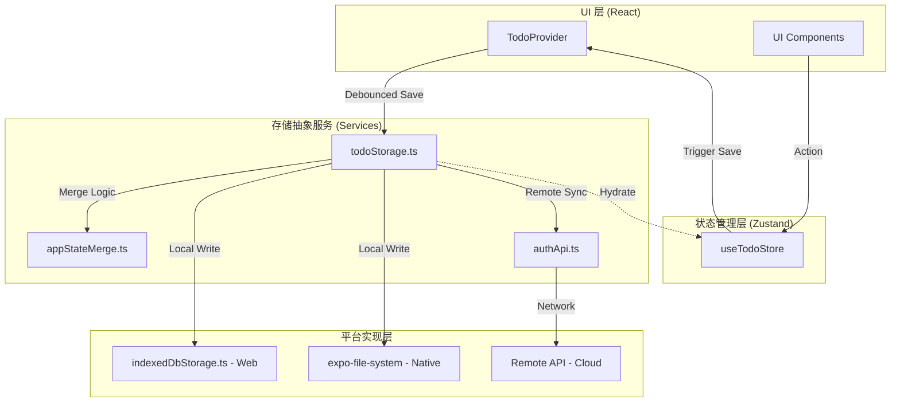
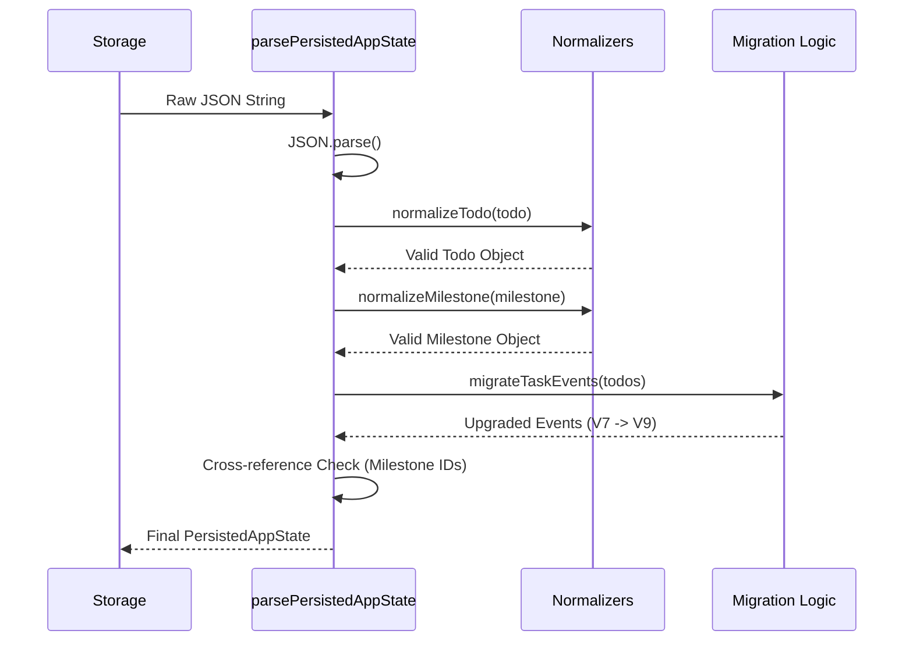
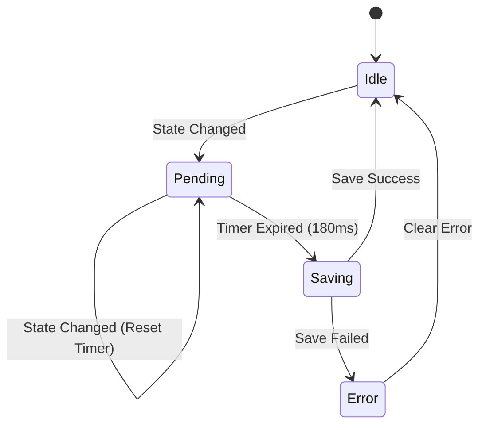

# 持久化层与存储实现

## 目录
1. [模块概览](#模块概览)
2. [引言](#引言)
3. [存储层架构设计](#存储层架构设计)
4. [存储抽象层 (todoStorage)](#存储抽象层-todostorage)
5. [数据标准化与迁移策略](#数据标准化与迁移策略)
6. [IndexedDB Web 实现](#indexeddb-web-实现)
7. [会话状态管理 (sessionStorage)](#会话状态管理-sessionstorage)
8. [持久化触发机制与生命周期](#持久化触发机制与生命周期)
9. [同步与冲突解决逻辑](#同步与冲突解决逻辑)
10. [异常处理与容错机制](#异常处理与容错机制)
11. [测试与验证](#测试与验证)
12. [核心组件](#核心组件)
13. [文件引用](#文件引用)

## 模块概览
在 LightFlux 项目中，持久化层是实现“本地优先”（Local-first）架构的核心。该模块确保了用户数据在各种网络环境下（包括完全离线）的安全性、一致性和快速响应能力。

通过对 `lightflux/services` 目录的探索，我们发现该模块包含以下核心组成部分：
- **总文件数**：共 8 个服务文件，其中 5 个直接涉及存储与同步逻辑。
- **子模块划分**：
    - **核心抽象层**：`todoStorage.ts`，定义了应用状态的加载、保存及跨端同步逻辑。
    - **平台适配层**：`indexedDbStorage.ts`（Web 端 IndexedDB 实现）和基于 `expo-file-system` 的原生端实现。
    - **状态合并层**：`appStateMerge.ts`，处理本地与远程数据的版本对比与合并。
    - **会话管理层**：`sessionStorage.ts`，负责持久化用户的登录状态。
    - **测试套件**：`lightflux/tests/todoStorageMigration.test.ts`，验证数据迁移的正确性。

本章节将深入探讨这些组件如何协同工作，构建起一个稳健的本地优先存储系统。

## 引言
LightFlux 的存储哲学建立在“数据属于用户”和“离线可用”的基础之上。为了实现这一目标，系统采用了复杂的持久化架构，不仅要处理简单的键值存储，还要应对多端同步、模式版本迁移（Schema Migration）以及高性能的读写需求。

### 核心目标
1. **本地优先**：所有用户操作首先反映在本地存储中，确保毫秒级的响应速度。
2. **离线持久化**：在无网络连接时，数据依然可以安全地保存在设备上。
3. **多端同步**：支持 Web 和移动端的数据同步，通过版本号和时间戳解决冲突。
4. **数据完整性**：通过严格的标准化（Normalization）流程，确保从存储中加载的数据符合最新的业务逻辑要求。

### 关键术语
- **Hydration（注水/初始化）**：指应用启动时从持久化存储中读取数据并恢复到内存状态（Zustand Store）的过程。
- **Persistence（持久化）**：将内存中的状态序列化并写入磁盘或数据库的过程。
- **LWW (Last Write Wins)**：最后写入者胜出的冲突解决策略，基于 `updatedAt` 时间戳。

## 存储层架构设计
LightFlux 的存储层采用了分层架构，从 UI 层到最终的物理存储介质，每一层都有明确的职责。这种设计通过依赖倒置原则，使得应用逻辑与具体的存储实现（如 IndexedDB 或文件系统）解耦。

下面的架构图展示了从用户操作到数据落盘的完整调用链路：



**架构说明**：
1. **UI 层**：通过 `TodoProvider` 监听 Store 的变化。
2. **状态管理层**：`useTodoStore` 维护内存中的实时数据。
3. **存储抽象服务**：`todoStorage.ts` 作为统一入口，协调本地存储、远程同步和数据合并逻辑。
4. **平台实现层**：根据运行环境选择 `IndexedDB`（Web）或原生文件系统，并可选地与云端 API 通信。

**Diagram sources**: 
- [todoStore.tsx:L765-L790](lightflux/store/todoStore.tsx#L765-L790)
- [todoStorage.ts:L425-L472](lightflux/services/todoStorage.ts#L425-L472)

## 存储抽象层 (todoStorage)
`todoStorage.ts` 是整个持久化系统的核心枢纽。它不关心具体的存储细节，而是定义了高级的 `loadAppState` 和 `saveAppState` 操作，并处理了复杂的跨平台逻辑和远程同步流程。

### 加载流程 (Hydration)
当应用启动时，`loadAppState` 会执行以下逻辑：
1. **读取本地状态**：根据平台调用 `loadDeviceState`。
2. **远程同步检查**：如果配置了远程认证，则尝试从云端加载状态。
3. **冲突解决**：使用 `selectLatestAppState` 对比本地和远程状态。如果远程更新，则更新本地缓存；如果本地更新，则尝试推送到远程。

### 保存流程 (Persistence)
`saveAppState` 负责将最新的状态持久化：
1. **立即保存到本地**：确保用户数据在本地万无一失。
2. **异步推送到远程**：如果已登录，将数据同步到服务器。

```typescript
// lightflux/services/todoStorage.ts

export const loadAppState = async (): Promise<PersistedAppState | null> => {
  const deviceState = await loadDeviceState();
  if (!isRemoteAuthConfigured) {
    return deviceState;
  }

  try {
    const remoteState = await loadRemoteAppState();
    if (!remoteState) return deviceState;

    const normalizedRemoteState = parsePersistedAppState(JSON.stringify(remoteState));
    if (normalizedRemoteState) {
      const latestState = selectLatestAppState(deviceState, normalizedRemoteState);
      // ... 自动同步逻辑
      return latestState;
    }
    return deviceState;
  } catch (error) {
    console.warn('Unable to load cloud data; using the local cache.', error);
    return deviceState;
  }
};
```

**Section sources**:
- [todoStorage.ts](lightflux/services/todoStorage.ts)
- [appStateMerge.ts](lightflux/services/appStateMerge.ts)

## 数据标准化与迁移策略
随着应用功能的迭代，数据结构（Schema）会发生变化。`todoStorage.ts` 中的 `parsePersistedAppState` 函数充当了“数据守门员”的角色，负责将旧版本的存储数据转换为当前应用所需的格式。

### 模式版本控制
LightFlux 使用 `schemaVersion` 来标识数据结构的版本。目前最新的版本是 `9`。当从存储中读取数据时，系统会检查版本号并执行必要的迁移。

### 标准化流程
标准化不仅是版本迁移，还包括数据清洗，防止由于软件 Bug 或手动篡改导致的非法数据进入内存：
- **Todo 修复**：确保每个任务都有 ID、标题和正确的日期格式。
- **关系校验**：如果任务关联的里程碑（Milestone）不存在，则将 `milestoneId` 重置为 `null`。
- **默认值填充**：为缺失的字段（如 `analyticsStartedAt`）提供默认值。

以下序列图展示了数据从原始 JSON 到标准化对象的转换过程：



**迁移逻辑说明**：
在 `todoStorage.ts` 中，`taskEvents` 的迁移是一个典型案例。旧版本（V7/V8）可能没有完整的事件记录，系统会调用 `migrateTaskEvents(todos)` 根据任务的当前状态（如 `createdAt`, `completedAt`）反向生成基础事件流，从而保证统计功能的正常运作。

**Section sources**:
- [todoStorage.ts:L310-L396](lightflux/services/todoStorage.ts#L310-L396)
- [todoStorageMigration.test.ts](lightflux/tests/todoStorageMigration.test.ts)

## IndexedDB Web 实现
在 Web 平台，由于 `localStorage` 存在容量限制（通常为 5MB）且是同步阻塞的，LightFlux 选择了 `IndexedDB` 作为主要存储引擎。

### 实现细节
`indexedDbStorage.ts` 封装了底层的 IndexedDB API，提供异步的 `loadWebState` 和 `saveWebState` 接口。

1. **数据库初始化**：创建一个名为 `lightflux` 的数据库，版本号为 `1`，并建立一个名为 `app-state` 的对象存储空间。
2. **单键存储**：为了简化逻辑，系统将整个应用状态序列化为 JSON 字符串，并存储在键名为 `current` 的记录中。
3. **事务处理**：使用 `readwrite` 事务确保写入的原子性。

### 降级方案 (Fallback)
如果浏览器不支持 IndexedDB（如某些隐私模式），系统会自动降级到 `localStorage`。在加载时，它还会尝试从 `localStorage` 迁移旧数据到 `IndexedDB`，实现平滑过渡。

```typescript
// lightflux/services/indexedDbStorage.ts

export const loadWebState = async (legacyStorageKey: string): Promise<string | null> => {
  try {
    const indexedState = await readIndexedState();
    if (indexedState) return indexedState;

    // 尝试从 localStorage 迁移
    const legacyState = runtime.localStorage?.getItem(legacyStorageKey);
    if (legacyState) {
      await writeIndexedState(legacyState);
      runtime.localStorage?.removeItem(legacyStorageKey);
      return legacyState;
    }
    return null;
  } catch (error) {
    // 降级到 localStorage
    return runtime.localStorage?.getItem(legacyStorageKey) ?? null;
  }
};
```

**Section sources**:
- [indexedDbStorage.ts](lightflux/services/indexedDbStorage.ts)

## 会话状态管理 (sessionStorage)
除了核心业务数据外，LightFlux 还需要持久化用户的会话状态（如是否已登录）。`sessionStorage.ts` 专门负责这一轻量级任务。

### 存储特性
- **数据量小**：仅存储简单的字符串标识（如 `signed-in` 或 `signed-out`）。
- **平台差异化**：
    - **Native**：使用 `expo-file-system` 写入 `lightflux-session.json`。
    - **Web**：使用 `localStorage`。
- **认证集成**：如果配置了远程认证，它会优先通过 `authApi` 校验远程会话。

这种分离确保了即使业务数据加载失败，用户的登录状态也能被正确识别，从而引导用户进行修复或重新登录。

**Section sources**:
- [sessionStorage.ts](lightflux/services/sessionStorage.ts)

## 持久化触发机制与生命周期
数据持久化不是在每次状态改变时立即发生的，而是通过一种“防抖保存”（Debounced Save）机制来平衡性能和可靠性。

### 180ms 防抖逻辑
在 `TodoProvider` 中，系统通过 `useEffect` 监听 Store 的变化。每当用户添加任务、修改标题或切换状态时，计时器会重置。只有在用户停止操作 180 毫秒后，才会触发真正的 `saveAppState`。



**逻辑说明**：
- **性能优化**：避免在快速打字或连续点击时频繁触发昂贵的磁盘/网络写入。
- **可靠性**：180ms 是一个极短的延迟，用户几乎感知不到，且足以在应用关闭前完成最后一次保存（配合 AppState 监听）。

**Section sources**:
- [todoStore.tsx:L765-L790](lightflux/store/todoStore.tsx#L765-L790)

## 同步与冲突解决逻辑
由于 LightFlux 支持离线操作，用户可能在不同设备上同时修改数据。系统采用了一种简单而有效的同步策略：**基于时间戳的最后写入者胜出 (LWW)**。

### 核心逻辑
在 `appStateMerge.ts` 中，`selectLatestAppState` 函数对比本地和远程状态的 `updatedAt` 字段。

1. **计算 `updatedAt`**：如果状态对象中没有显式的时间戳，系统会遍历所有任务、分组和里程碑，取其中的最大值作为整体状态的最后更新时间。
2. **版本对比**：
    - 如果 `remote.updatedAt > local.updatedAt`，则远程数据被认为是“真理”，本地将被覆盖。
    - 反之，本地数据将通过 `saveRemoteAppState` 推送到云端。

这种策略虽然简单，但能覆盖 95% 以上的单用户多端使用场景。

**Section sources**:
- [appStateMerge.ts](lightflux/services/appStateMerge.ts)
- [todoStorage.ts:L441-L455](lightflux/services/todoStorage.ts#L441-L455)

## 异常处理与容错机制
持久化层必须能够优雅地处理各种异常情况，如磁盘空间不足、数据库损坏或网络超时。

### 错误状态追踪
`todoStore` 中维护了 `persistenceReady` 和 `persistenceErrorAt` 状态：
- **Hydration 失败**：如果 `loadAppState` 抛出异常，应用会进入“错误模式”，设置 `persistenceReady: false`，并记录错误时间。
- **保存失败**：如果 `saveAppState` 失败，系统会捕获错误并更新 `persistenceErrorAt`，UI 可以据此向用户展示警告（如“数据保存失败，请检查存储空间”）。

### 容错策略
- **Web 端降级**：如前所述，IndexedDB 失败时自动使用 localStorage。
- **云端同步失败**：如果网络不可用，`loadAppState` 会静默失败并回退到本地缓存，确保应用依然可用。

**Section sources**:
- [todoStore.tsx:L120-L148](lightflux/store/todoStore.tsx#L120-L148)
- [indexedDbStorage.ts:L108-L112](lightflux/services/indexedDbStorage.ts#L108-L112)

## 测试与验证
为了确保数据在版本升级过程中不丢失，LightFlux 编写了详尽的迁移测试。

在 `todoStorageMigration.test.ts` 中，测试用例模拟了从旧版本（如 V7）加载数据的场景，并验证：
- 是否正确生成了缺失的 `milestones` 数组。
- 是否根据旧任务状态正确重建了 `taskEvents`。
- 是否正确过滤了损坏或非法的记录（如指向不存在任务的事件）。

这些测试是持久化层稳定性的基石，确保了核心业务逻辑在数据结构演进时的连续性。

**Section sources**:
- [lightflux/tests/todoStorageMigration.test.ts](lightflux/tests/todoStorageMigration.test.ts)

## 核心组件
以下是持久化层中最重要的类和函数：

| 组件 | 位置 | 职责 |
| :--- | :--- | :--- |
| `loadAppState` | `todoStorage.ts` | 跨平台加载状态，处理远程同步与合并。 |
| `saveAppState` | `todoStorage.ts` | 将状态持久化到本地和远程。 |
| `parsePersistedAppState` | `todoStorage.ts` | 数据标准化、清洗与版本迁移。 |
| `writeIndexedState` | `indexedDbStorage.ts` | Web 端 IndexedDB 写入逻辑。 |
| `loadSessionState` | `sessionStorage.ts` | 加载用户会话标识。 |
| `selectLatestAppState` | `appStateMerge.ts` | 执行 LWW 冲突解决策略。 |

## 文件引用
以下是构建持久化层涉及的关键源文件：

- [lightflux/services/todoStorage.ts](lightflux/services/todoStorage.ts) - 存储抽象与同步逻辑核心
- [lightflux/services/indexedDbStorage.ts](lightflux/services/indexedDbStorage.ts) - Web 端 IndexedDB 实现
- [lightflux/services/sessionStorage.ts](lightflux/services/sessionStorage.ts) - 会话状态持久化
- [lightflux/services/appStateMerge.ts](lightflux/services/appStateMerge.ts) - 状态合并与冲突解决
- [lightflux/services/authApi.ts](lightflux/services/authApi.ts) - 远程同步 API
- [lightflux/store/todoStore.tsx](lightflux/store/todoStore.tsx) - 持久化触发与 UI 状态集成
- [lightflux/tests/todoStorageMigration.test.ts](lightflux/tests/todoStorageMigration.test.ts) - 数据迁移测试用例
