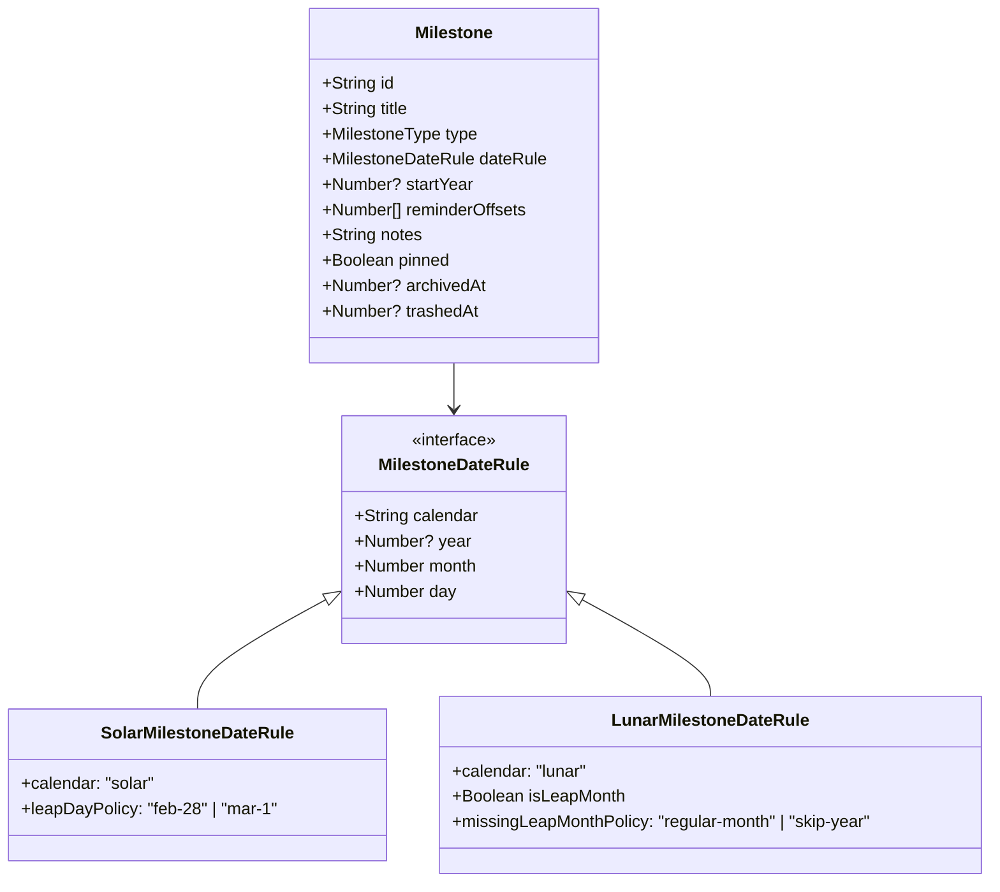
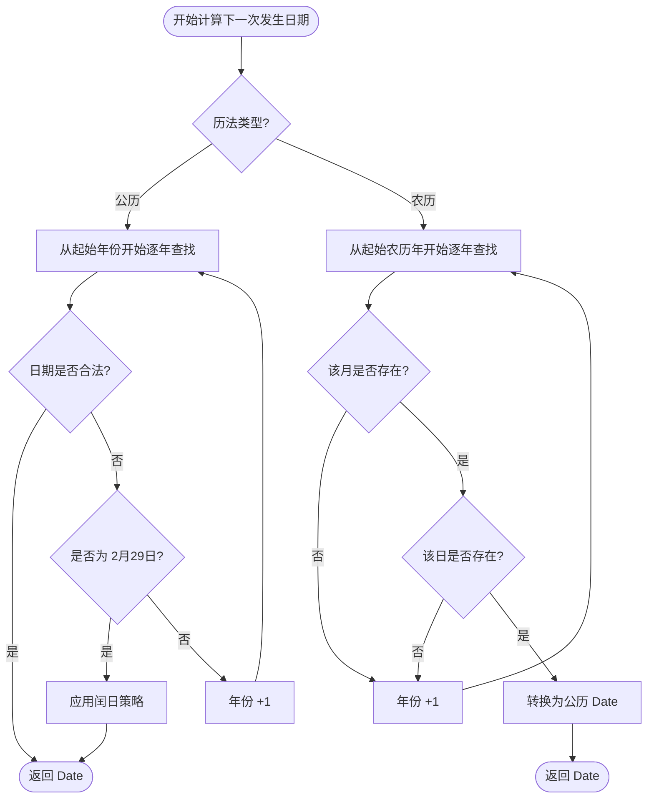
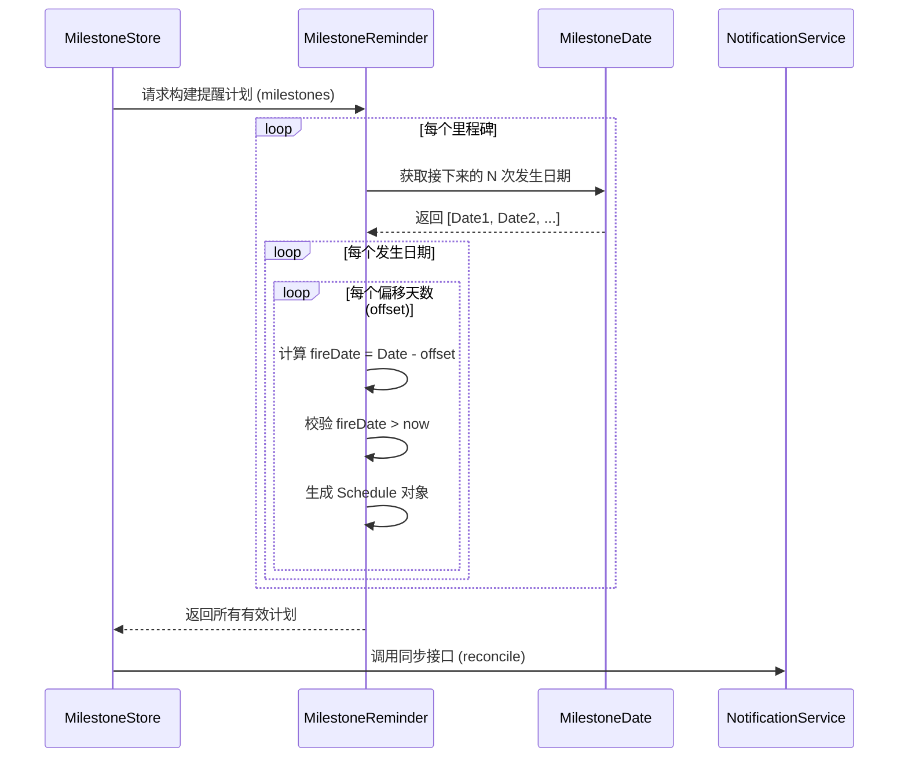
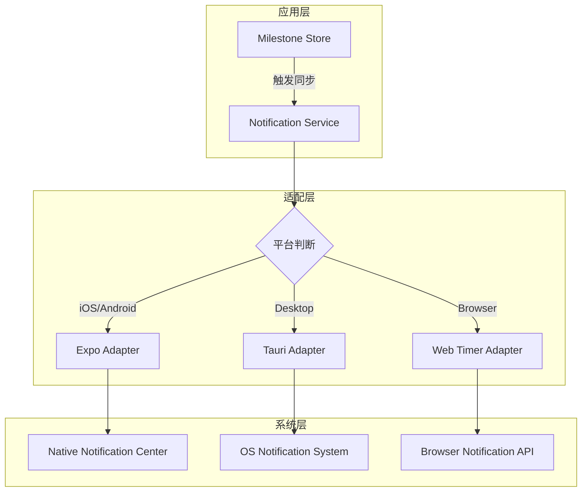

# 里程碑与双历系统

## 目录
1. [模块概览](#模块概览)
2. [引言](#引言)
3. [里程碑数据模型](#里程碑数据模型)
4. [双历转换核心引擎](#双历转换核心引擎)
   - [公历处理逻辑](#公历处理逻辑)
   - [农历处理逻辑](#农历处理逻辑)
5. [提醒计算与调度](#提醒计算与调度)
6. [跨平台通知服务集成](#跨平台通知服务集成)
7. [AI 智能指令集成](#ai-智能指令集成)
8. [核心组件参考](#核心组件参考)
9. [关键源文件引用](#关键源文件引用)

## 模块概览

LightFlux 的里程碑系统是一个高度集成的功能模块，旨在处理复杂的日期计算和跨平台通知。该模块涉及约 40 个源文件，涵盖了从底层算法到 UI 呈现的完整链路。

- **核心逻辑文件**：3 个 (`milestoneDate.ts`, `milestoneReminder.ts`, `milestoneDomain.ts`)
- **服务与集成**：2 个 (`milestoneNotifications.ts`, `milestoneCommandExecutor.ts`)
- **UI 组件**：约 10 个 (位于 `lightflux/components/milestones/`)
- **测试用例**：3 个 (`milestoneDate.test.ts`, `milestoneReminder.test.ts` 等)

本章节将重点深入解析 `lightflux/utils/milestoneDate.ts` 中的历法转换算法、`lightflux/utils/milestoneReminder.ts` 中的提醒计算逻辑，以及 `lightflux/services/milestoneNotifications.ts` 中的通知调度机制。

## 引言

里程碑（Milestone）系统是 LightFlux 的核心特性之一，它不仅是简单的日期记录工具，更是一个支持**公历（Solar）**与**农历（Lunar）**双历法的智能提醒引擎。

在东亚文化圈中，农历生日、春节等传统节日具有极高的重要性。LightFlux 通过引入 `lunar-typescript` 库，实现了精确的农历转换，并妥善处理了农历闰月、公历 2 月 29 日等复杂边界情况。里程碑系统与任务系统深度集成，支持将里程碑关联至特定任务，并提供灵活的“提前 N 天”提醒功能。

## 里程碑数据模型

里程碑的数据结构设计兼顾了灵活性与严谨性。核心接口 `Milestone` 定义在 `lightflux/types/todo.ts` 中，通过 `dateRule` 字段区分公历和农历规则。

下面的类图展示了里程碑及其相关规则的层次结构：

在上述模型中，`MilestoneDateRule` 是一个联合类型。`SolarMilestoneDateRule` 引入了 `leapDayPolicy`，用于决定在非闰年时如何处理 2 月 29 日（是提前到 2 月 28 日还是推迟到 3 月 1 日）。`LunarMilestoneDateRule` 则包含了 `isLeapMonth` 标记，用于支持农历闰月的精准匹配，并提供了 `missingLeapMonthPolicy` 来处理某些年份不存在该闰月的情况。

**数据模型源码参考**:
- [lightflux/types/todo.ts](lightflux/types/todo.ts)

## 双历转换核心引擎

`lightflux/utils/milestoneDate.ts` 是整个里程碑系统的“大脑”。它负责将用户定义的日期规则转换为具体的公历日期（`Date` 对象），以便进行后续的排序和提醒计算。

### 公历处理逻辑

公历的计算相对直观，但仍需处理 2 月 29 日这一特殊日期。系统通过 `solarOccurrence` 函数实现：

1. 如果是普通日期，直接构建 `Date` 对象。
2. 如果是 2 月 29 日且当前年份非闰年，则根据 `leapDayPolicy` 返回 2 月 28 日或 3 月 1 日。

### 农历处理逻辑

农历计算则复杂得多，依赖于 `lunarOccurrence` 函数。该函数利用 `lunar-typescript` 库进行核心转换：

1. **年份定位**：首先根据 `lunarYear` 获取农历年份对象。
2. **月份匹配**：处理闰月逻辑。如果规则要求是闰月（`isLeapMonth: true`），系统会检查该年是否存在对应的闰月。如果不存在，则根据策略跳过该年或回退到普通月份。
3. **日期校验**：农历月份的天数不固定（29 或 30 天）。如果规则定义的日期（如 30 号）在某个月份不存在，该次发生将被视为无效。

下面的流程图描述了从日期规则到下一次发生日期（Occurrence）的计算过程：

该流程确保了无论是公历还是农历，系统都能找到最接近当前时间的下一个有效日期。对于农历，系统会自动处理大小月和闰月的差异，这在处理如“农历正月初一”或“农历八月十五”等重复性事件时至关重要。

**核心算法源码参考**:
- [lightflux/utils/milestoneDate.ts](lightflux/utils/milestoneDate.ts)

## 提醒计算与调度

一旦确定了里程碑的发生日期，`lightflux/utils/milestoneReminder.ts` 就会介入，根据用户设置的 `reminderOffsets`（提醒偏移天数）计算具体的提醒时间。

### 提醒计算策略

1. **多级提醒**：用户可以设置多个偏移量，例如“当天（0天）”、“提前 1 天”、“提前 7 天”。
2. **未来预测**：系统会计算接下来的多次发生（通常是前 4 次），并为每一次发生生成对应的提醒计划。
3. **去重与过滤**：
   - 过滤掉已经过去的提醒时间。
   - 对同一偏移量在不同发生日期之间的提醒进行限制（防止提醒过多）。
   - 统一在早晨 9:00（`REMINDER_HOUR`）触发提醒。

下面的序列图展示了提醒计划的生成过程：

在生成计划后，系统会按照触发时间（`fireDate`）对所有计划进行排序，确保通知服务能有序地处理这些提醒。

**提醒逻辑源码参考**:
- [lightflux/utils/milestoneReminder.ts](lightflux/utils/milestoneReminder.ts)

## 跨平台通知服务集成

`lightflux/services/milestoneNotifications.ts` 负责将计算出的提醒计划落地到具体的硬件设备上。由于 LightFlux 支持 Web、iOS、Android 以及桌面端（Tauri），通知服务必须具备高度的适配性。

### 平台适配策略

- **移动端 (Expo)**：使用 `expo-notifications` 调度本地通知。系统会先清空旧的通知请求，然后根据 `MAX_IOS_SCHEDULES` 等限制重新调度。
- **桌面端 (Tauri)**：利用 `@tauri-apps/plugin-notification` 插件。由于 Tauri 使用数字 ID，系统通过哈希算法（`tauriNotificationId`）将字符串 Key 转换为唯一的数字 ID。
- **Web 端 (浏览器)**：由于浏览器不支持持久化的定时通知，系统使用运行时的 `setTimeout` 模拟提醒。如果用户刷新页面，提醒会重新计算并挂载。

下面的架构图展示了通知服务的层次结构：

通知服务还包含了一个关键的“对账”（Reconciliation）机制。每当里程碑数据发生变化时，`reconcileMilestoneNotifications` 函数会被调用，它会对比当前的提醒计划与系统中已存在的通知，确保两者同步，避免重复提醒或漏掉提醒。

**通知服务源码参考**:
- [lightflux/services/milestoneNotifications.ts](lightflux/services/milestoneNotifications.ts)

## AI 智能指令集成

LightFlux 的 AI 助手可以通过自然语言管理里程碑。`lightflux/agent/milestoneCommandExecutor.ts` 负责解析 AI 生成的指令并执行相应的领域操作。

AI 支持的操作包括：
- `milestone.create`：创建里程碑，自动根据语义匹配 `MilestoneType` 和图标。
- `milestone.update`：更新里程碑属性，如修改提醒时间或备注。
- `milestone.trash` / `milestone.archive`：删除或归档里程碑。

执行器内置了严格的校验逻辑，例如标题长度限制、颜色格式校验以及日期规则的合法性检查（调用 `isValidMilestoneDateRule`）。这种分层设计确保了即使 AI 生成了不规范的参数，核心业务逻辑依然是安全的。

**AI 执行器源码参考**:
- [lightflux/agent/milestoneCommandExecutor.ts](lightflux/agent/milestoneCommandExecutor.ts)

## 核心组件参考

### 1. `getMilestoneOccurrence`
这是计算核心，返回里程碑的下一次发生信息。
- **输入**：`Milestone` 对象，可选的 `from` 日期。
- **输出**：`MilestoneOccurrence` 接口，包含 `date`、`daysFrom`（距离今天的天数）和 `sequenceNumber`（第几次周年）。

### 2. `reconcileMilestoneNotifications`
通知同步入口，确保本地通知队列与内存中的里程碑状态一致。
- **逻辑**：构建计划 -> 平台分发 -> 权限校验 -> 调度执行。

## 关键源文件引用

以下是本模块涉及的核心文件列表：

- **领域模型与存储**
  - [lightflux/types/todo.ts](lightflux/types/todo.ts): 定义了 `Milestone` 及相关规则的 TypeScript 接口。
  - [lightflux/store/milestoneDomain.ts](lightflux/store/milestoneDomain.ts): 包含里程碑的分类过滤逻辑和 UI 主题配置。

- **工具函数与算法**
  - [lightflux/utils/milestoneDate.ts](lightflux/utils/milestoneDate.ts): **核心文件**，实现公农双历转换及发生日期计算。
  - [lightflux/utils/milestoneReminder.ts](lightflux/utils/milestoneReminder.ts): 实现提醒偏移量的计算和计划生成。

- **服务与集成**
  - [lightflux/services/milestoneNotifications.ts](lightflux/services/milestoneNotifications.ts): 跨平台通知调度服务。
  - [lightflux/agent/milestoneCommandExecutor.ts](lightflux/agent/milestoneCommandExecutor.ts): AI 指令执行器。

- **测试与验证**
  - [lightflux/tests/milestoneDate.test.ts](lightflux/tests/milestoneDate.test.ts): 覆盖了闰月、闰日等复杂边界情况的单元测试。
  - [lightflux/tests/milestoneReminder.test.ts](lightflux/tests/milestoneReminder.test.ts): 验证提醒计划生成的准确性。
